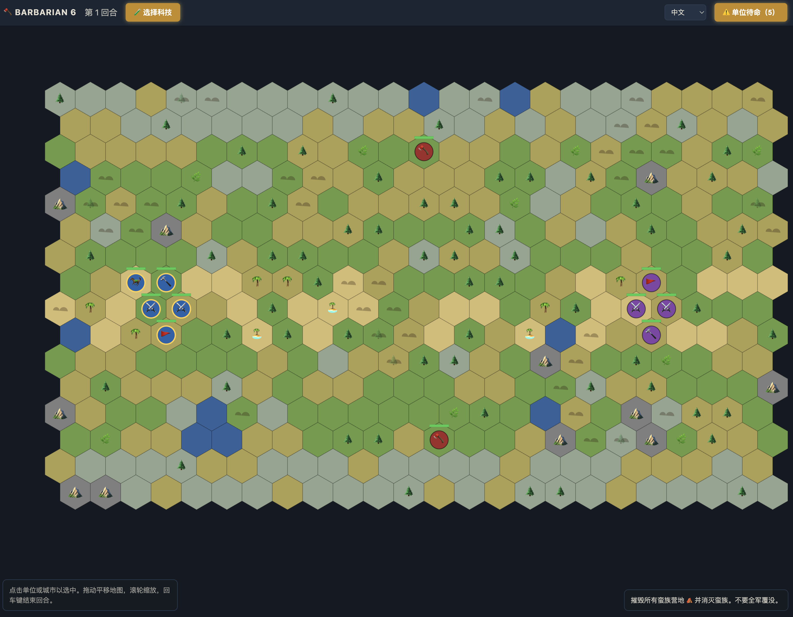
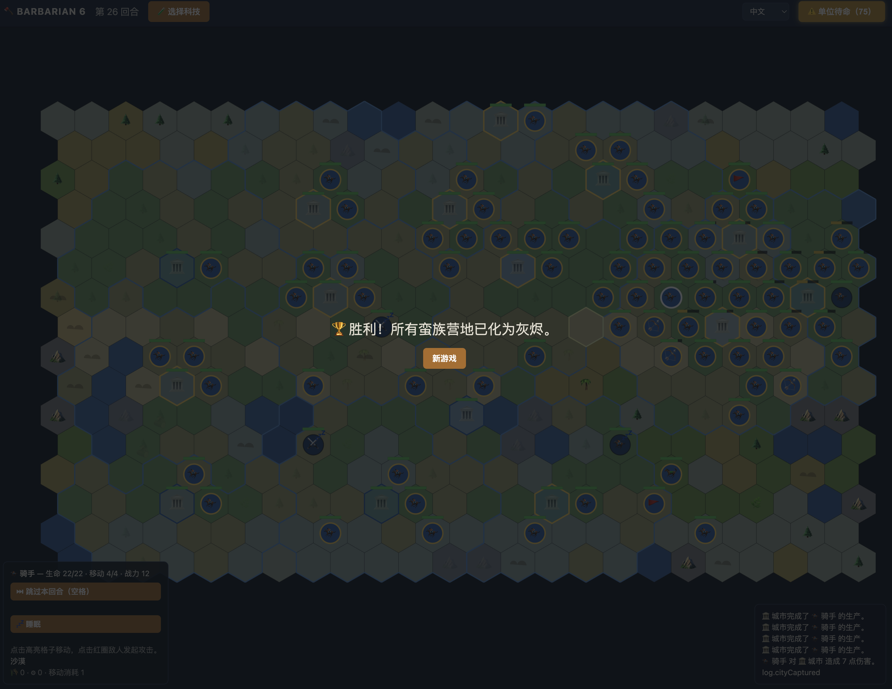

# 🪓 Barbarian 6

A simplified Civilization-style hex strategy game for the browser. Raze every
barbarian camp and slay the barbarians before they wipe out your warband.

**Play it**: https://yorange2.github.io/barbarian6/ (deployed from `main` via
GitHub Actions)

## Run it

```sh
npm install
npm run dev      # dev server with hot reload
npm run build    # production build in dist/ (deployable to GitHub Pages / itch.io)
```

## How to play

- **Click** one of your units (blue) to select it; highlighted hexes are where it can move this turn.
- **Click** a red-ringed adjacent enemy to attack (defender strikes back).
- **Drag** to pan the map, **scroll** to zoom, **Enter** (or the button) ends the turn.
- Civ-style tiles: terrain (grassland 2🌾, plains 1🌾1⚙, desert, tundra 1🌾)
  with an optional hills attribute (+1⚙, +1 move, +3 defense) and at most one
  feature on top — woods (+1⚙, +3 def, choppable for 20⚙), rainforest (+1🌾,
  +3 def, choppable), marsh (+1🌾, −2 def, drainable), oasis (+3🌾, desert
  only). Water and mountains are impassable. Defenders get their tile's
  combat bonus. City output sums every tile in its territory; each pop eats
  2 food.
- Camps ⛺ spawn a new barbarian every 6 turns — raze them by moving onto them.
- The Settler 🚩 founds a city (must be 3+ hexes from another city). Cities
  accumulate production ⚙ each turn and build new units — click a city to
  choose what it produces. Barbarians attack cities; a city at 0 HP is razed.
- Cities grow: food 🌾 accumulates each turn and raises population, which adds
  production and science. Farms feed growth; mines and lumber camps add
  production.
- Cities have territory (blue border): 1 hex at founding, expanding to 2 hexes
  at population 3 and 3 hexes at population 5. Claimed tiles never change
  hands; a razed city frees its territory.
- The Builder 🔨 has 3 charges to build a farm 🌾 (grassland), mine ⛏️ (hills,
  requires Mining tech), or lumber camp 🪵 (forest) — only inside your own
  territory, and only improvements inside a city's territory count toward its
  yields.
- Research 🧪: pick a tech from the top-bar tech button. Mining → Bronze
  Working (🛡️ Spearman), The Wheel (🏇 Horseman), Masonry (city walls);
  Archery unlocks the 🏹 Archer, which strikes 2 hexes away with no
  retaliation.
- Units that spend a full turn resting heal 4 HP.

## Languages

English and 简体中文, switchable from the top bar (persisted in `localStorage`,
default follows the browser language). All UI text lives in `src/i18n.ts`; the
combat log stores message keys instead of text, so switching language also
re-translates past log entries. To add a language, add a dictionary to
`src/i18n.ts` and an `<option>` to the picker in `index.html`.

## Screenshots

A fresh game — your warband (blue, west), the rival empire (purple, east), and barbarians (red) between them:



Victory, with the map fully explored and settled:



## Code layout

| File | What it does |
| --- | --- |
| `src/hex.ts` | Axial hex-coordinate math (see [Red Blob Games](https://www.redblobgames.com/grids/hexagons/)) |
| `src/map.ts` | Terrain types and random map generation |
| `src/game.ts` | Game rules: units, movement, combat, barbarian AI, win/lose |
| `src/render.ts` | Canvas 2D rendering of the map, units, and highlights |
| `src/main.ts` | Input handling, camera, and DOM UI wiring |
